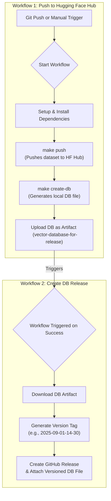

# `hf-vector-pipeline`

[](https://github.com/nikitabugrovsky/hf-vector-pipeline/actions/workflows/huggingface-push.yml)
[](https://github.com/nikitabugrovsky/hf-vector-pipeline/actions/workflows/create-release.yml)

## Overview

This repository contains a data pipeline for building, managing, and utilizing Hugging Face datasets with vector embeddings. It provides a fully automated, chained workflow to generate datasets, push them to the Hugging Face Hub, and then create versioned releases of a ready-to-use SQLite vector database.

The primary goal is to create a seamless bridge between raw data, the Hugging Face ecosystem, and local vector search applications by providing versioned, downloadable database artifacts.

## Features

-   **Automated Hugging Face Push**: Automatically builds a dataset with embeddings and pushes it to the Hugging Face Hub on changes to source files (`.csv`, `.py`) or manual trigger.
-   **Automated Database Generation**: After the push to the Hub, a `sqlite-vec` compatible database is created from the dataset.
-   **Automated Versioned Releases**: On a successful push, a secondary workflow automatically creates a new GitHub Release with a timestamped, compressed database file, making it easy to download specific versions.
-   **Chained CI/CD Workflows**: Uses two separate GitHub Actions workflows that trigger in sequence, separating concerns between the Hugging Face update and the GitHub Release creation.
-   **Comprehensive Testing**: Includes both unit and integration tests to ensure the reliability of the CLI and the database embedding retrieval.
-   **Optimized Execution**: Utilizes `uv` for fast dependency installation and caches dependencies to speed up workflow runs.

## Workflow Diagram

The diagram below illustrates the complete, chained workflow of the pipeline.



## Usage

### Local Execution

To run parts of the pipeline locally for development or testing.

1.  **Install Dependencies**:
    ```bash
    make install
    ```

2.  **Set Environment Variables**:
    ```bash
    export SOURCE_DATA_FILE="city-nicknames.csv"
    export TARGET_DATASET_REPO="your-hf-username/your-dataset-name"
    export EMBEDDING_MODEL_NAME="all-MiniLM-L6-v2"
    export HF_TOKEN="hf_..." # Your Hugging Face write token
    ```

3.  **Run Pipeline Steps**:
    *   Push to Hugging Face Hub: `make push`
    *   Create the local database: `make create-db`
    *   Run all tests: `make test-cli && make test-db`

### Automated GitHub Workflow (Recommended)

This is the primary way to use the pipeline. The full process is automated.

1.  **Fork the Repository**: Create your own copy of this repository.

2.  **Configure GitHub Secrets and Variables**:
    *   Go to `Settings` > `Secrets and variables` > `Actions`.
    *   **Secret**: Create a new repository secret named `HF_TOKEN` with your Hugging Face write token.
    *   **Variables (Optional)**: You can override the defaults by setting `SOURCE_DATA_FILE`, `TARGET_DATASET_REPO`, and `EMBEDDING_MODEL_NAME` as repository variables.

3.  **Trigger the Workflow**: The end-to-end process can be triggered in two ways:
    *   **Automatically**: Pushing a change to a `.csv` or `.py` file on the `main` branch.
    *   **Manually**: Navigating to the `Actions` tab, selecting the "Push to Hugging Face Hub" workflow, and clicking "Run workflow".

Upon a successful run, a new GitHub Release will be created with your versioned database file attached.

## Testing

The repository includes a test suite to ensure correctness.

-   **Unit Tests (`tests/test_hugging_cli.py`)**: These tests validate the core logic of the `hugging_cli.py` script in isolation. They use mocks to simulate external dependencies like the Hugging Face Hub and the Sentence Transformer model, ensuring the argument parsing and data processing functions work as expected.

-   **Integration Tests (`tests/test_query_embedding.py`)**: This test ensures that the pipeline can successfully connect to a real `sqlite-vec` database file and retrieve vector embeddings, verifying their shape, data type, and values. It serves as a true end-to-end check for the database creation and query process.

You can run all tests locally using the following command:
```bash
make test-db && make test-cli
```
